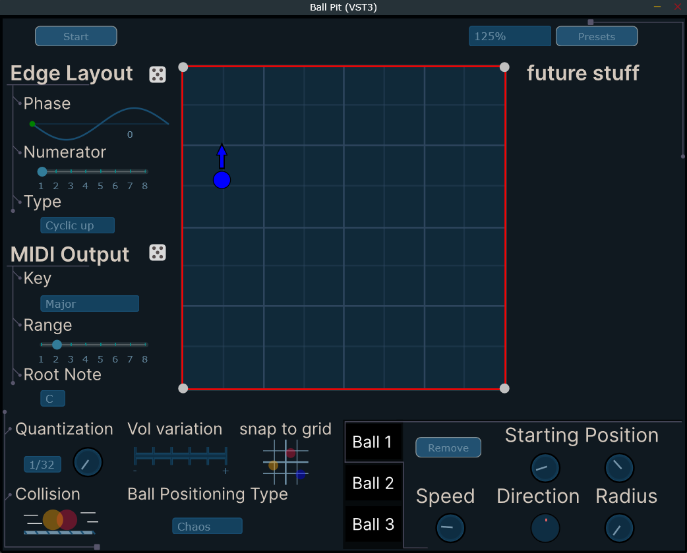

# BallPit

A MIDI plugin that celebrates the chaos and unpredictability of one of kids most favorite/hated place to play- the ball pit.

Each hit between a ball and the pit walls, or between two balls will generate a different and customizable output.

***Components:***

**Edge**
* Phase: Startting point of the different notes on the edge
* Numerator: Number of notes diviations spread on the edge
* type: The order of chosen notes uppon the edge

**Scale**

* Key: The different notes 
* Range: Number of note starting from the root note that can be spread on the edge
* Root note: The root note that sets the notes by the key

**Note Settings**

* Transpose: The relative root note transpose, where note C with transpose 0 is C5
* Probability: The odds in percentages of each note to be heard

**General**

* Quantization: Combobox is for the quantization size in bars, nad the dial is for the quantization percentage
* Collision: Choose whether the balls will collide or pass through each other
* Vol variation: By percentages, gives a small variation to the vaolume of each note output
* Snap to grid: The option to snap the balls on the pit's grid on a 1/8 intervals
* Ball Movement type: Choose whether the balls move by a freely chosen speed and direction or by set tempo for each axis

**For each ball there is a tab including:**

* Add/Remove buttton: for each ball on the pit
* Starting position: corresponds to the ball position's x and y on the pit
* Radius: The size of the ball (which affect its colume output slightly)
* Speed and Direction: The speed and direction of the ball when movement type is Chaos
* SpeedX and SpeedY: The speed in tempo diviations for each axis. small arrows buttons for the chosen direction of the set tempo speed
* Delay: sets a "tail" for the ball that follows its movement and multiplies the output notes by a chosen- Number of repeats, feedback percentages, delay times and note movements.