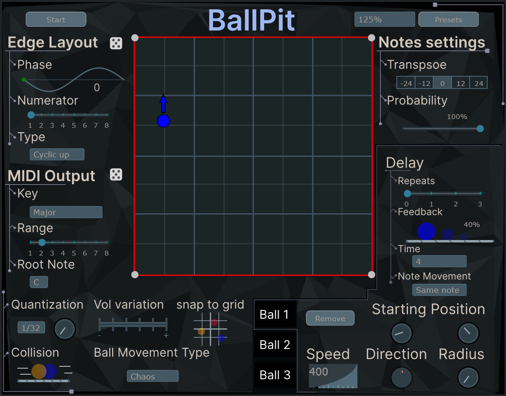

# BallPit
A MIDI plugin that celebrates the chaos and unpredictability of one of kids most favorite/hated place to play- the ball pit.

Each hit between a ball and the pit walls, or between two balls will generate a different and customizable output like notes, chords and other interesting stuff in plan...

This is a temporary layout for development process:

Currently don't have a dedicated CMake pipeline so building plugin through Projucer.